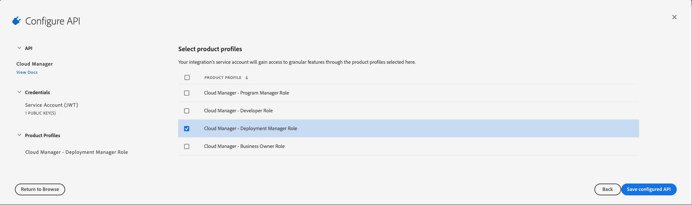

## Creating an API Integration

To work with the Cloud Manager API on the Adobe I/O Console, you need to either the System Administrator role or be an assigned API Developer for your organization. Click [here](http://www.adobe.com/go/aac_api_prod_learn) to learn more about the API Developer role.

When you receive notification of this role, click the **Get Started** button in the message to access services.

All requests to the Cloud Manager API must be authenticated using an access token retrieved using a JSON Web Token (JWT). The [Adobe I/O JWT Documentation](https://www.adobe.io/authentication/auth-methods.html#!AdobeDocs/adobeio-auth/master/JWT/JWT.md) provides a guide to creating the certificate files necessary to set up the integration as well as instructions for how to generate your first access token.

Once you've generated your certificate, to create an API Integration:

1. Navigate to the following URL: [https://console.adobe.io/integrations](https://console.adobe.io/integrations).

2. Click the `New integration` button.

3. Select the `Access an API` option and then click `Continue`.

4. Under the Experience Cloud section select `Cloud Manager` and then click `Continue`.

5. Select `New integration` and then click `Continue`.

6. Fill out the name and description.

7. Upload your certificate file.

8. Select one of the Product Profiles to assign the integration to a [specific Cloud Manager role](https://www.adobe.com/go/aem_cloud_mrg_usersroles_en).

> If you are an API Developer in the organization, you may be restricted as to which Product Profiles you can select here.

9. Click `Create Integration`.

Your client is now created. Notice your client has an `API Key (Client ID)` and an `Organization ID`. You'll need these when making API calls. You will also need the `Technical Account ID` and `Client Secret` values to obtain an Access Token.

