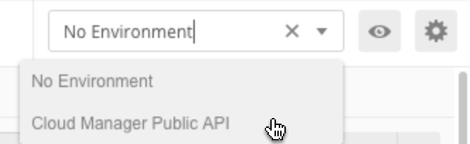
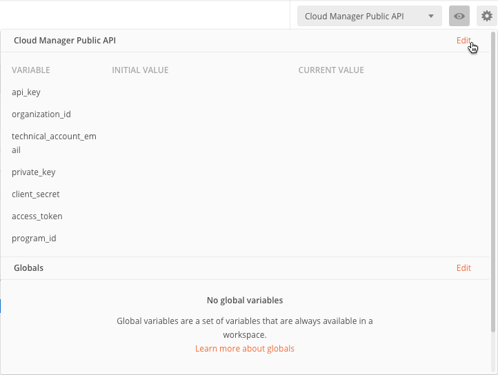
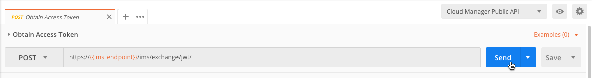

## Getting Started with Postman

[Postman](https://www.getpostman.com/) is an HTTP API-focused development environment which many developers used to experiment with APIs similar to the Cloud Manager API.

If you use Postman, there is a Cloud Manager-specific collection which can be imported into your workspace using the button below.

[](https://app.getpostman.com/run-collection/3ab610ab110a6a5fd18b#?env%5BCloud%20Manager%20Public%20API%5D=W3siZGVzY3JpcHRpb24iOnsiY29udGVudCI6IiIsInR5cGUiOiJ0ZXh0L3BsYWluIn0sInZhbHVlIjoiIiwia2V5IjoiYXBpX2tleSIsImVuYWJsZWQiOnRydWV9LHsiZGVzY3JpcHRpb24iOnsiY29udGVudCI6IiIsInR5cGUiOiJ0ZXh0L3BsYWluIn0sInZhbHVlIjoiIiwia2V5Ijoib3JnYW5pemF0aW9uX2lkIiwiZW5hYmxlZCI6dHJ1ZX0seyJkZXNjcmlwdGlvbiI6eyJjb250ZW50IjoiIiwidHlwZSI6InRleHQvcGxhaW4ifSwidmFsdWUiOiIiLCJrZXkiOiJ0ZWNobmljYWxfYWNjb3VudF9pZCIsImVuYWJsZWQiOnRydWV9LHsiZGVzY3JpcHRpb24iOnsiY29udGVudCI6IiIsInR5cGUiOiJ0ZXh0L3BsYWluIn0sInZhbHVlIjoiIiwia2V5IjoicHJpdmF0ZV9rZXkiLCJlbmFibGVkIjp0cnVlfSx7ImRlc2NyaXB0aW9uIjp7ImNvbnRlbnQiOiIiLCJ0eXBlIjoidGV4dC9wbGFpbiJ9LCJ2YWx1ZSI6IiIsImtleSI6ImNsaWVudF9zZWNyZXQiLCJlbmFibGVkIjp0cnVlfSx7InZhbHVlIjoiIiwia2V5IjoiYWNjZXNzX3Rva2VuIiwiZW5hYmxlZCI6dHJ1ZX0seyJrZXkiOiJwcm9ncmFtX2lkIiwidmFsdWUiOiIiLCJkZXNjcmlwdGlvbiI6IiIsImVuYWJsZWQiOnRydWV9XQ==)

### Configuration

The requests in this collection depend upon a set of Postman environment variables. After you click the button above, a new environment will be created named `Cloud Manager Public API` which has the necessary variables defined. First, select this environment from the environment drop-down list.

Then click on the eye icon to view the environment variables and click the Edit link to edit the variables.

Four of these values need to be populated using the values displayed in the Adobe I/O Console.

* `api_key`
* `organization_id`
* `technical_account_id`
* `client_secret`

The `private_key` variable needs to be populated with the contents of the `private.key` file generated by Open SSL as described in the [Adobe I/O JWT Quickstart](https://www.adobe.io/authentication/auth-methods.html#!adobeio/adobeio-documentation/master/auth/JWTAuthenticationQuickStart.md).

### Obtaining the Access Token

Once the environment variables are populated, open the Obtain Access Token request from the Cloud Manager Public API collection and click the Send button.

This will automatically set the `access_token` environment variable with a token which is valid for 24 hours. If you need to refresh it, just re-send this request.

### Executing Other Requests

In addition to the Obtain Access Token request, the collection includes other requests which can be executed.

If you create your own requests in Postman, keep in mind that they must always include the `Authorization`, `x-gw-ims-org-id`, and `x-api-key` headers. The `Authorization` header will be automatically inherited for requests defined in the `Cloud Manager Public API` collection, but if you create your own requests outside of this collection, you will need to configure this header, using the `access_token` envrionment variable.