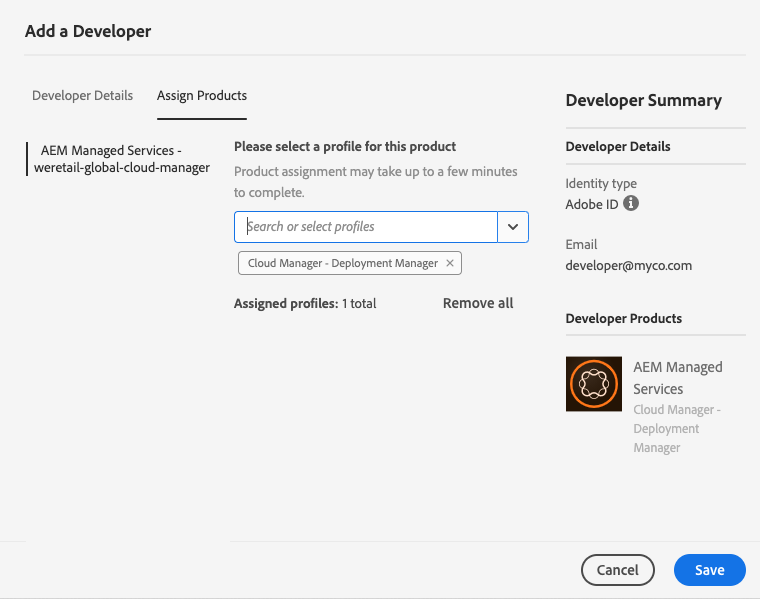
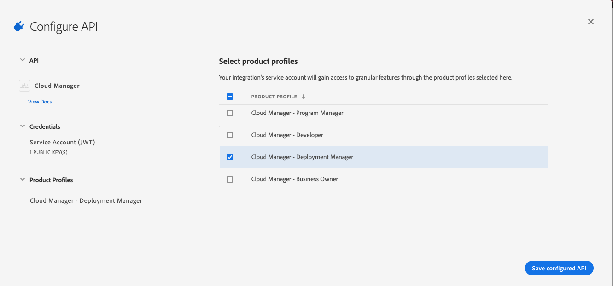

## API Permissions

The Cloud Manager API is accessed using a technical service account created using the Adobe I/O Console. This service account can only be used to access the API -- it does not have a normal password and so cannot be used to log into Cloud Manager or Experience Cloud in general. Although this service account is effectively created by an individual, it is "owned" by the organization. As a result, when looking at the permissions required to use the Cloud Manager API, there are two separate permissions to consider. The first is the permission required to create the project in the Adobe I/O Console. The second is the permission assigned to the service account.

### I/O Console Project Creation Permission

Creating a project with the Cloud Manager API in the Adobe I/O Console is allowed for authenticated users who are _either_ System Administrators in the target organization _or_ are assigned Developer Access for one of more Cloud Manager product profiles. A user who is a System Administrator in the target organization can create projects in I/O Console with any of the Cloud Manager product profiles whereas a user with Developer Access is explicitly allowed to create projects using a subset of product profiles.

To assign a user Developer Access, in the [Adobe Admin Console](https://adminconsole.adobe.com/), click the `Add Developer` link. Enter the email address and click the `Assign Products` tab. Then select the product and product profiles desired before clicking `Save`. For example, in the image below, the user would have the ability to create projects in Adobe I/O Console with the `Cloud Manager - Deployment Manager` product profile.

> It is important to understand that this does **not** enable this user (`developer@myco.com` in this example) to actually log into Cloud Manager or Experience Cloud. This only enables this user to create projects in Adobe I/O Console.

### Cloud Manager API Permissions

Interactions with the Cloud Manager API using the service account are permitted based on the product profiles assigned to the service account. When creating or editing a project in Adobe I/O Console, the product profiles for that project are selectable.

> Which profiles are listed here depends on the user -- if this was done using the `developer@myco.com` user created above, **only** the `Cloud Manager - Deployment Manager` product profile would be displayed.

Which product profile(s) to select depends upon the specific requirements for the project and what APIs will be accessed. In general terms, if only read (`GET`) access is required, the Developer product profile will be sufficient. Guidance for projects which require write (`PUT`, `DELETE`, `PATCH`) access:

<table>
    <thead>
        <tr>
            <th>Operation</th>
            <th>Product Profile(s)</th>
        </tr>
    </thead>
    <tbody>
        <tr>
            <td class="column--operation"><code class=" language-undefined">startPipeline</code></td>
            <td>Business Owner, Deployment Manager, Program Manager</td>
        </tr>
        <tr>
            <td colspan="2" class="column--uri"><code class=" language-undefined">PUT /api/program/{programId}/pipeline/{pipelineId}/execution</code></td>
        </tr>
        <tr>
            <td><code class=" language-undefined">advancePipelineExecution</code></td>
            <td>Business Owner, Deployment Manager, Program Manager</td>
        </tr>
        <tr>
            <td colspan="2" class="column--uri"><code class=" language-undefined">PUT /api/program/{programId}/pipeline/{pipelineId}/execution/{executionId}/phase/{phaseId}/step/{stepId}/advance</code></td>
        </tr>
        <tr>
            <td><code class=" language-undefined">cancelPipelineExecutionStep</code></td>
            <td>Business Owner, Deployment Manager, Program Manager</td>
        </tr>
        <tr>
            <td colspan="2" class="column--uri"><code class=" language-undefined">PUT /api/program/{programId}/pipeline/{pipelineId}/execution/{executionId}/phase/{phaseId}/step/{stepId}/cancel</code></td>
        </tr>
        <tr>
            <td><code class=" language-undefined">deleteEnvironment</code></td>
            <td>Business Owner, Deployment Manager</td>
        </tr>
        <tr>
            <td colspan="2" class="column--uri"><code class=" language-undefined">DELETE /api/program/{programId}/environment/{environmentId}</code></td>
        </tr>
        <tr>
            <td><code class=" language-undefined">deleteProgram</code></td>
            <td>Business Owner, Deployment Manager</td>
        </tr>
        <tr>
            <td colspan="2" class="column--uri"><code class=" language-undefined">DELETE /api/program/{programId}</code></td>
        </tr>
        <tr>
            <td><code class=" language-undefined">deletePipeline</code></td>
            <td>Deployment Manager</td>
        </tr>
        <tr>
            <td colspan="2" class="column--uri"><code class=" language-undefined">DELETE /api/program/{programId}/pipeline/{pipelineId}</code></td>
        </tr>
        <tr>
            <td><code class=" language-undefined">patchEnvironmentVariables</code></td>
            <td>Deployment Manager</td>
        </tr>
        <tr>
            <td colspan="2" class="column--uri"><code class=" language-undefined">PATCH /api/program/{programId}/environment/{environmentId}/variables</code></td>
        </tr>
        <tr>
            <td><code class=" language-undefined">patchPipelineVariables</code></td>
            <td>Deployment Manager</td>
        </tr>
        <tr>
            <td colspan="2" class="column--uri"><code class=" language-undefined">PATCH /api/program/{programId}/pipeline/{pipelineId}/variables</code></td>
        </tr>
    </tbody>
</table>

> One exception case where read access requires a specific product profile is _reading_ pipeline variables. This requires the Deployment Manager role.

