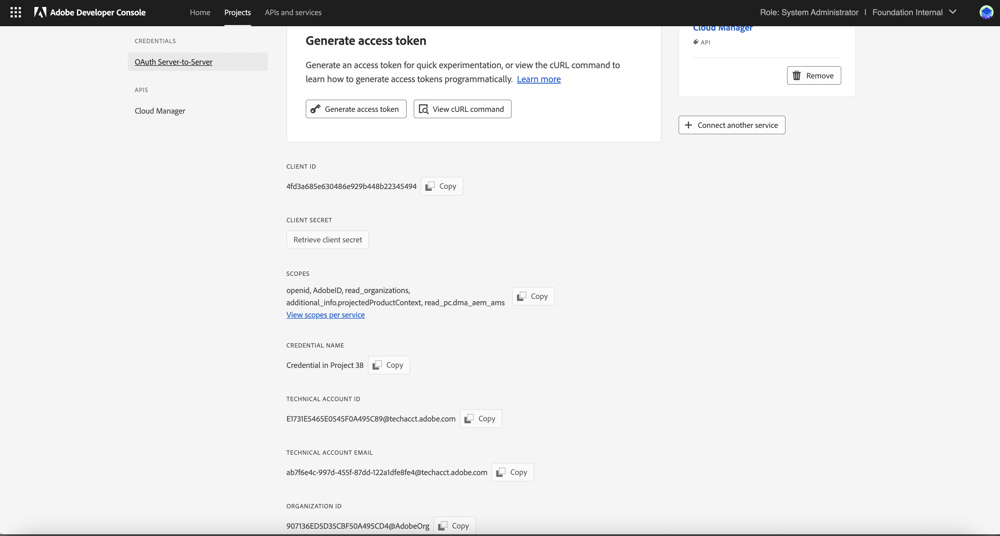
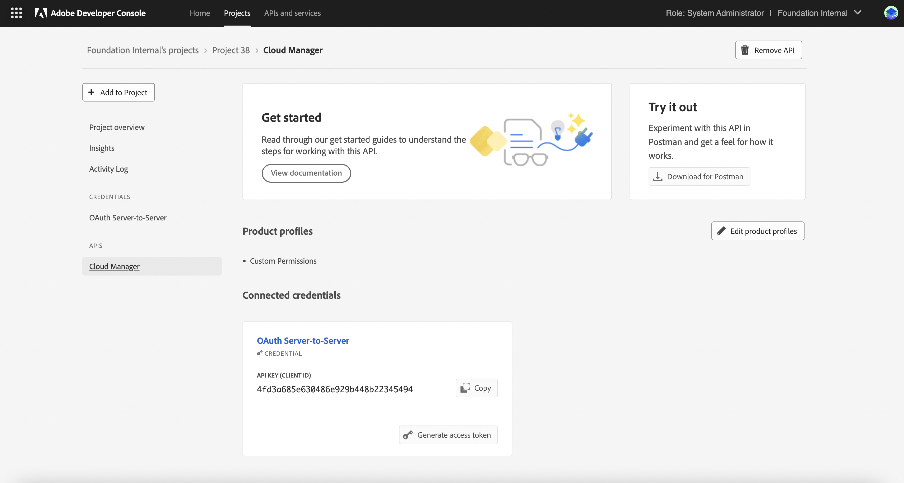
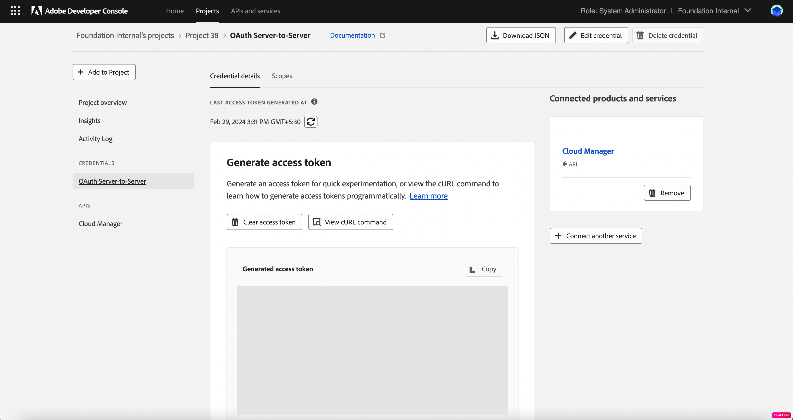
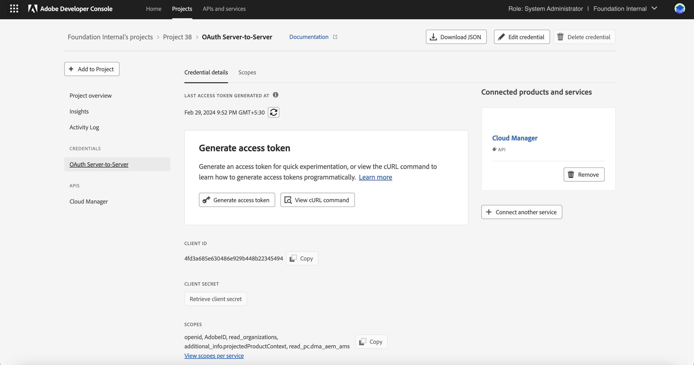

# Authentication

## Authentication Headers

<InlineAlert slots="text" variant="warning"/>

The Service Account (JWT) credentials have been deprecated in favor of the OAuth Server-to-Server credentials. Creating new JWT credentials will stop by May 1, 2024. Your applications using JWT credentials will stop working after Jan 1, 2025. You must migrate to the new credential by Jan 1, 2025, to ensure your application continues functioning. [In order to generate JWT access token](jwt-authentication.md).

Every inbound HTTP API call to the Cloud Manager API must contain these three headers:

* `x-api-key`
* `x-gw-ims-org-id`
* `Authorization`

The values which should be sent in the `x-api-key` and `x-gw-ims-org-id` headers are provided in the Credentials details screen in the [Adobe Developer Console](https://developer.adobe.com/console). The value of the `x-api-key` header is the _Client ID_ and the value for the `x-gw-ims-org-id` header is the _Organization ID_.

The `Authorization` header's value is in the form `Bearer` followed by a generated access token, e.g. `Bearer somelongtokenvalue`.

## Generating an Access Token

### Manual Generation Using Adobe Developer Console

<InlineAlert slots="text" variant="warning"/>

Please note that tokens generated through the AEM Developer Console cannot be used with the Cloud Manager API. If you want to manually generate a token, you must use the Adobe Developer Console.

Generating an access token can be done by navigating to the Cloud Manager API page for the project in the Adobe Developer Console.

Upon clicking the _Generate access token_ button, an access token will be generated and can be copied to the clipboard.

Access tokens generated in this fashion will be valid for 24 hours, after which a new token must be generated.

### Programatic Generation

Generating access tokens for OAuth Server-to-Server credential is straightforward. You can click on `View cURL command` and then copy the cURL on the credential overview page.

<InlineAlert variant="help" slots="text"/>

The below is a summary of this process. Complete documentation can be found in the [Adobe I/O OAuth Documentation](https://developer.adobe.com/developer-console/docs/guides/authentication/ServerToServerAuthentication/implementation/)

The query parameters includes:

* `client_id`- the Client ID from the Adobe Developer Console integration.
* `client_secret`	- the Client SECRET retrieved from the Adobe Developer Console integration.
* `grant_type` - it is equal to 'client_credentials'.
* `scope` - the SCOPES from the Adobe Developer Console integration.

And then these parameters are then included in the body of a `POST` request sent to https://ims-na1.adobelogin.com/ims/token/v3.
