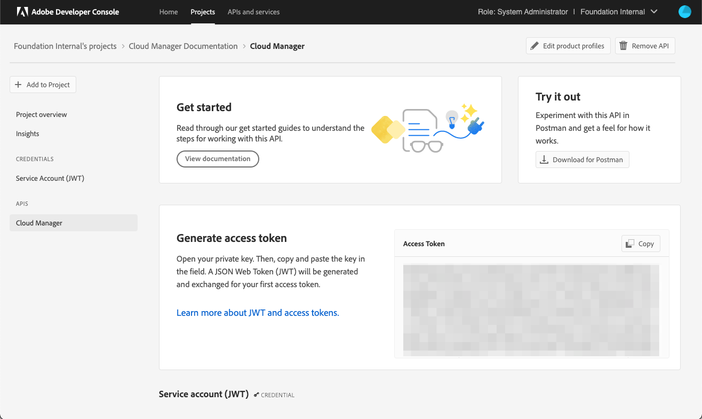

# JWT Authentication

## Authentication Headers

#### Note that generation of JWT access token is deprecated. Documentation can be found in the [Adobe I/O JWT Documentation](https://developer.adobe.com/developer-console/docs/guides/authentication/JWT/)

Every inbound HTTP API call to the Cloud Manager API must contain these three headers:

* `x-api-key`
* `x-gw-ims-org-id`
* `Authorization`

The values which should be sent in the `x-api-key` and `x-gw-ims-org-id` headers are provided in the Credentials details screen in the [Adobe Developer Console](https://developer.adobe.com/console). The value of the `x-api-key` header is the _Client ID_ and the value for the `x-gw-ims-org-id` header is the _Organization ID_.

The `Authorization` header's value is in the form `Bearer` followed by a generated access token, e.g. `Bearer somelongtokenvalue`.

## Generating an Access Token

### Manual Generation Using Adobe Developer Console

<InlineAlert variant="warning" slots="text"/>

Please note that tokens generated through the AEM Developer Console cannot be used with the Cloud Manager API. If you want to manually generate a token, you must use the Adobe Developer Console.

Generating an access token can be done by navigating to the Cloud Manager API page for the project in the Adobe Developer Console and pasting the private key for the project.

Upon clicking the _Generate Token_ button, an access token will be generated and can be copied to the clipboard.

Access tokens generated in this fashion will be valid for 24 hours, after which a new token must be generated.

### Programatic Generation

Programmatic generation of an access token is done by generating a JSON Web Token (JWT) and exchanging it with the Adobe Identity Management Service (IMS) for an access token.

<InlineAlert variant="help" slots="text"/>

The below is a summary of this process. Complete documentation can be found in the [Adobe I/O JWT Documentation](https://developer.adobe.com/developer-console/docs/guides/authentication/JWT/)

The JWT is constructed as a JSON object with these keys, referred to as _claims_:

* `exp`- the requested expiration of the access token, expressed as a number of seconds since January 1st 1970 GMT. For most use cases, this should be a relatively small value, e.g. 5 minutes. For example, for five minutes from now, this value should be <Epoch addition={300} />.
* `iss`	- the Organization ID from the Adobe Developer Console project, in the format org_ident@AdobeOrg.
* `sub` - the Technical Account ID from the Adobe Developer Console integration, in the format: id@techacct.adobe.com.
* `aud` - the Client ID from the Adobe Developer Console integration _prepended_ with `https://ims-na1.adobelogin.com/c/`.
* `https://ims-na1.adobelogin.com/s/ent_cloudmgr_sdk` - set to the literal value `true`.

This JSON object must be then base64 encoded and signed using the private key for the project.

Finally, the encoded value is sent in the body of a `POST` request to https://ims-na1.adobelogin.com/ims/exchange/jwt along with the Client ID and Client Secret for the project.

#### Language Support for JWT

While it is possible to do the entire JWT generation and exchange process in custom code, it is more common to use a higher-level library to do so. A number of such libraries are listed on the [Adobe I/O JWT Documentation](https://developer.adobe.com/developer-console/docs/guides/authentication/JWT/).
