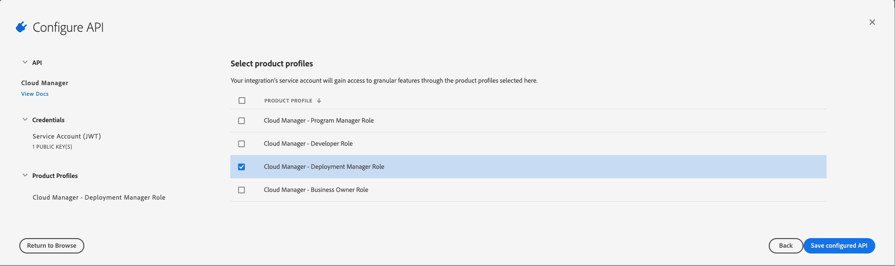

# Creating an API Integration Project

In order to make API calls to the Cloud Manager API, you must create a _project_ (formerly known as an _integration_) in the [Adobe Developer Console](https://developer.adobe.com/console). This project defines the credentials used when making API calls as well as the permissions associated with those credentials.

To work with the Cloud Manager API on the Adobe Developer Console, you need to either the System Administrator role or be an assigned API Developer for your organization. Click [here](http://www.adobe.com/go/aac_api_prod_learn) to learn more about the API Developer role.

<InlineAlert slots="text" />

Note that the API Developer role required to create integrations in the Adobe Developer Console is unrelated to the Developer role within Cloud Manager (i.e. the "Developer - Cloud Manager" or "Developer - Cloud Service" product profile). The former is assigned to a user who is permitted to create integrations in the Adobe Developer Console. The latter is assigned to a user who has development rights _within_ Cloud Manager itself. Granting one of these does not grant the other.

When you receive notification of this role, click the **Get Started** button in the message to access services.

All requests to the Cloud Manager API must be authenticated using an access token retrieved using a JSON Web Token (JWT). The [Adobe I/O JWT Documentation](https://developer.adobe.com/developer-console/docs/guides/authentication/JWT/) provides a guide to creating the certificate files necessary to set up the integration as well as instructions for how to generate your first access token.

Once you've generated your certificate, to create an API Integration:

1. Navigate to the following URL: [https://developer.adobe.com/console](https://developer.adobe.com/console). This can also be reached by clicking the Console button at the top of this page.

2. Click the `Create new project` button or select an existing project.

3. (Optional) Click the `Edit project` button and give your project a title and description.

4. Click the `Add to Project` button and select `API` from the drop-down menu.

5. Under the Experience Cloud section select `Cloud Manager` and then click `Next`.

6. Generate or Upload a key pair. Click either `Generate keypair` or `Next`. If you generate a key pair, be sure to retain the downloaded file -- it **cannot** be recovered if lost and you will have to generate a new key pair.

7. Select one of the Product Profiles to assign the integration to a [specific Cloud Manager role](https://www.adobe.com/go/aem_cloud_mrg_usersroles_en).

<InlineAlert slots="text" />

If you are an API Developer in the organization, you may be restricted as to which Product Profiles you can select here.

9. Click `Save configured API`.

Your client is now created. Notice your client has an `Client ID` (sometimes referred to as an API Key) and an `Organization ID`. You'll need these when making API calls. You will also need the `Technical Account ID` and `Client Secret` values to obtain an Access Token.
