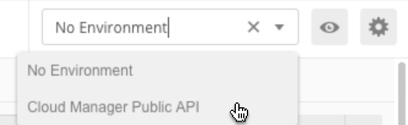
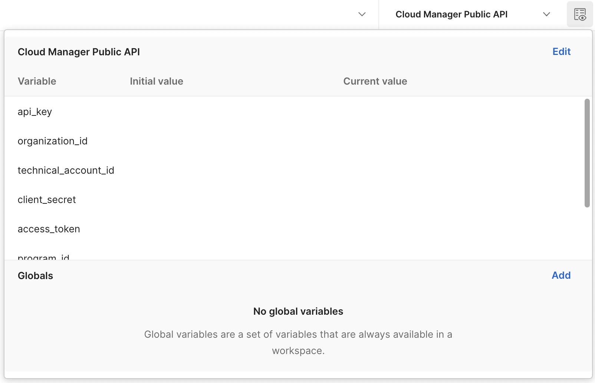
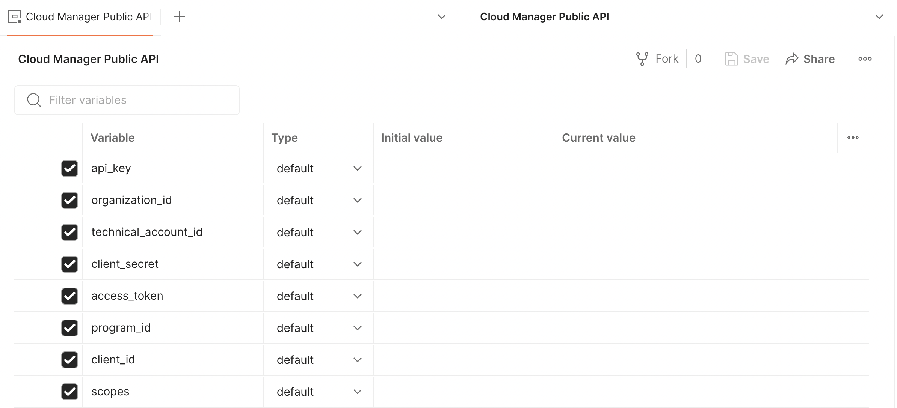
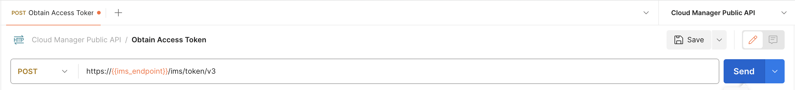

import RunInPostman from '../../../components/run-in-postman.js'

# Getting Started with Postman

[Postman](https://www.getpostman.com/) is an HTTP API-focused development environment which many developers used to experiment with APIs similar to the Cloud Manager API.

If you use Postman, there is a Cloud Manager-specific collection which can be imported into your workspace using the button below.

<RunInPostman collectionId="310288-4106f3eb-6ab1-47d8-8e4a-14120a7d706b" param="env%5BCloud%20Manager%20Public%20API%5D=W3sia2V5IjoiYXBpX2tleSIsInZhbHVlIjoiIiwiZW5hYmxlZCI6dHJ1ZSwic2Vzc2lvblZhbHVlIjoiIiwic2Vzc2lvbkluZGV4IjowfSx7ImtleSI6Im9yZ2FuaXphdGlvbl9pZCIsInZhbHVlIjoiIiwiZW5hYmxlZCI6dHJ1ZSwic2Vzc2lvblZhbHVlIjoiIiwic2Vzc2lvbkluZGV4IjoxfSx7ImtleSI6InRlY2huaWNhbF9hY2NvdW50X2lkIiwidmFsdWUiOiIiLCJlbmFibGVkIjp0cnVlLCJzZXNzaW9uVmFsdWUiOiIiLCJzZXNzaW9uSW5kZXgiOjJ9LHsia2V5IjoiY2xpZW50X3NlY3JldCIsInZhbHVlIjoiIiwiZW5hYmxlZCI6dHJ1ZSwic2Vzc2lvblZhbHVlIjoiIiwic2Vzc2lvbkluZGV4IjozfSx7ImtleSI6ImFjY2Vzc190b2tlbiIsInZhbHVlIjoiIiwiZW5hYmxlZCI6dHJ1ZSwic2Vzc2lvblZhbHVlIjoibnVsbCIsInNlc3Npb25JbmRleCI6NH0seyJrZXkiOiJwcm9ncmFtX2lkIiwidmFsdWUiOiIiLCJlbmFibGVkIjp0cnVlLCJzZXNzaW9uVmFsdWUiOiIiLCJzZXNzaW9uSW5kZXgiOjV9LHsia2V5IjoiY2xpZW50X2lkIiwidmFsdWUiOiIiLCJlbmFibGVkIjp0cnVlLCJ0eXBlIjoiZGVmYXVsdCIsInNlc3Npb25WYWx1ZSI6IiIsInNlc3Npb25JbmRleCI6Nn0seyJrZXkiOiJzY29wZXMiLCJ2YWx1ZSI6IiIsImVuYWJsZWQiOnRydWUsInR5cGUiOiJkZWZhdWx0Iiwic2Vzc2lvblZhbHVlIjoiIiwic2Vzc2lvbkluZGV4Ijo3fV0=" />

## Collection Variables

This collection defines a number of variables which are used in the contained requests. In general, you do not need to modify these variables; if you copy the request definitions from this collection to another collection, you should be sure to set these variables.

* `host_name` - The Cloud Manager API host name, `cloudmanager.adobe.io`.
* `ims_endpoint` - The host name for the Adobe Identity Management System (IMS), `ims-na1.adobelogin.com`.

## Configuration

The requests in this collection depend upon a set of Postman environment variables. After you click the button above, a new environment will be created named `Cloud Manager Public API` which has the necessary variables defined. First, select this environment from the environment drop-down list.

Then click on the eye icon to view the environment variables and click the Edit link to edit the variables.

Six of these values need to be populated using the values displayed in the Adobe Developer Console.

* `api_key`
* `organization_id`
* `technical_account_id`
* `client_id`
* `client_secret`
* `scopes`

## Obtaining the Access Token

Once the environment variables are populated, open the Obtain Access Token request from the Cloud Manager Public API collection and click the Send button.

This will automatically set the `access_token` environment variable with a token which is valid for 24 hours. If you need to refresh it, just re-send this request.

<InlineAlert slots="text" variant="warning"/>

Note that generation of JWT access token is deprecated in favor of the OAuth Server-to-Server credentials. Creating new JWT credentials will stop by May 1, 2024. [Learn more](https://developer.adobe.com/developer-console/docs/guides/authentication/JWT/).

## Executing Other Requests

In addition to the Obtain Access Token request, the collection includes other requests which can be executed.

If you create your own requests in Postman, keep in mind that they must always include the `Authorization`, `x-gw-ims-org-id`, and `x-api-key` headers. The `Authorization` header will be automatically inherited for requests defined in the `Cloud Manager Public API` collection, but if you create your own requests outside of this collection, you will need to configure this header, using the `access_token` environment variable.
