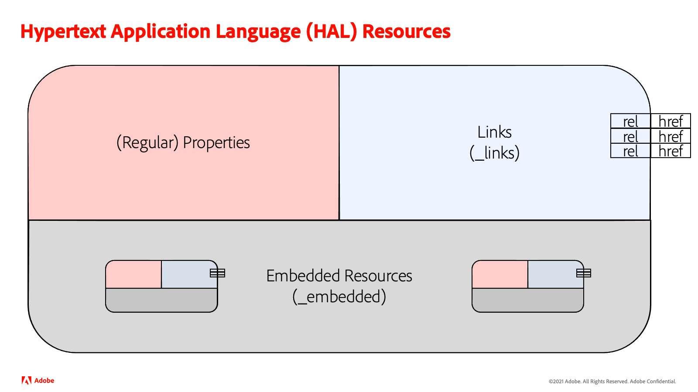

# Understanding the API

The Cloud Manager API is composed of two components:

* An _inbound_ HTTP-based API which can be used by Cloud Manager customers to read and manipulate the state of their CI/CD pipelines.
* An _outbound_ event system which allows Cloud Manager customers to receive events when key events happen in their CI/CD pipelines.

While it is possible to use **only** one or the other of these components, in most cases integrations will use both components. That said, it is best to start with just one, get it working, and then move on to the other component.

The steps to get started are different for these two components. Read [Create API Integration](create-api-integration.md) to get started with the inbound API and [Create Event Integration](create-event-integration.md) to get started with the event API.

## Resource Structure

The HTTP API is designed to be resource-orientated. Cloud Manager entities are represented as individual resources in a structure based on the Hypertext Application Language (HAL) specification. Each resource is composed of three logical sections:

* Regular properties of the resource, e.g. the name of a pipeline.
* Links to other resources, e.g. a link from a pipeline to the list of executions of that pipeline.
* Embedded resources, e.g. when retriving a list of pipelines, each pipeline is embedded in the list resource.

The embedded resources themselves may contain links and _other_ embedded resources.



### Links

Links in a resource are defined using a link type (commonly called a "rel", short for relationship). The special link type `self` is a link to the resource itself. 

```json
"_links": {
    "http://ns.adobe.com/adobecloud/rel/execution": {
        "href": "/api/program/4/pipeline/1/execution",
        "templated": false
    },
    "http://ns.adobe.com/adobecloud/rel/executions": {
        "href": "/api/program/4/pipeline/1/executions",
        "templated": false
    },
    "http://ns.adobe.com/adobecloud/rel/program": {
        "href": "/api/program/4",
        "templated": false
    },
    "self": {
        "href": "/api/program/4/pipeline/1",
        "templated": false
    }
}
```

Links may be [URI Templates](https://datatracker.ietf.org/doc/html/rfc6570) in which case the `templated` property would be `true`. Links may also be arrays.

### Embedded Resources

Embedded resources are named, like links. In some cases, a resource may have a more constrained representation when embedded. These cases are indicated in the documentation and, should a full representation be necessary, the `self` link can be used to retrieve it.

```json
"_embedded": {
    "pipelines": [
        {
            "_links": {...},
            "id": "1",
            "programId": "4",
            "name": "main",
            "trigger": "MANUAL",
            "status": "IDLE",
            "updatedAt": "2019-07-09T13:10:56.125+0000",
            "lastStartedAt": "2019-07-09T02:05:42.134+0000",
            "lastFinishedAt": "2019-07-09T13:10:56.033+0000"
        }
    ]
}
```

## Event Structure

Events are represented as JSON objects which follow the [Activity Stream](https://www.w3.org/TR/activitystreams-core/) specification. Each event has a type, contained in the `@type` property, and an object, defined in the `activitystreams:object` property. More information can be found on the [Receiving Events](../api-usage/receiving-events/) page as well as the [Reference Documentation](../../reference/events/).

### Example

```json
{
  "event_id" : "3dd172b8-3e54-491b-b87c-409cb71c4bc3",
  "event" : {
    "@id" : "urn:oeid:cloudmanager:bc901126-5eb1-4942-a1d1-9ec3a17f8a7a",
    "@type" : "https://ns.adobe.com/experience/cloudmanager/event/started",
    "activitystreams:published" : "2021-08-23T08:37:41.846Z",
    "activitystreams:to" : {
      "@type" : "xdmImsOrg",
      "xdmImsOrg:id" : "1234567890ABCDEF12345678@AdobeOrg"
    },
    "activitystreams:object" : {
      "@id" : "https://cloudmanager.adobe.io/api/program/1/pipeline/2/execution/3",
      "@type" : "https://ns.adobe.com/experience/cloudmanager/pipeline-execution"
    },
    "xdmEventEnvelope:objectType" : "https://ns.adobe.com/experience/cloudmanager/pipeline-execution"
  }
}
```