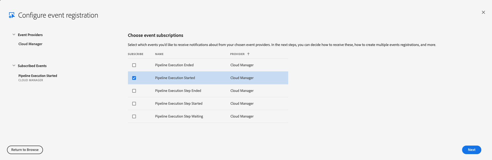
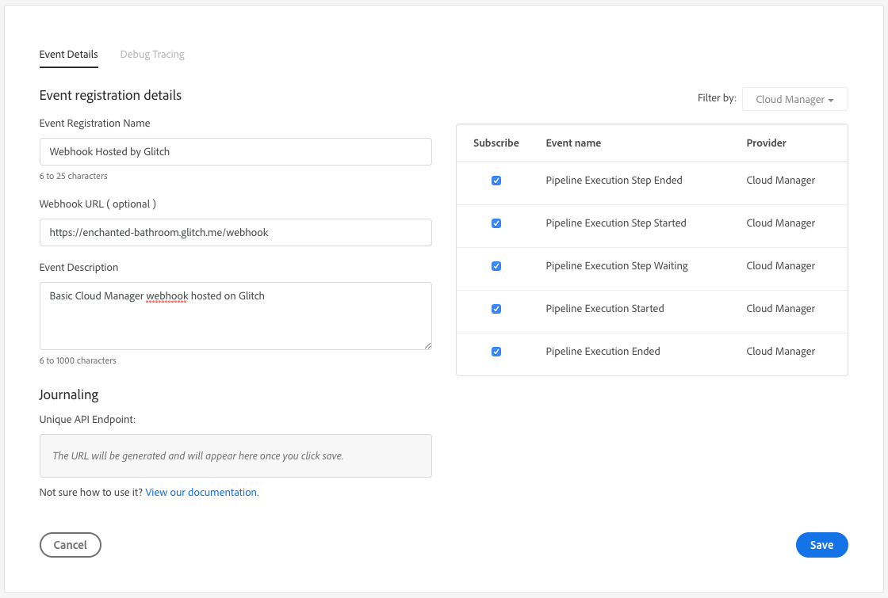

import Glitch from "../../components/glitch"

# Tutorial Step 1 - A Basic Webhook

In the first step of the tutorial, we're going to create an event handler (webhook) which is compatible with Adobe I/O Events. This webhook doesn't actually do much; it just logs the body of the request. But it provides a skeleton on which you'll build in later steps.

## Dependencies

To write the webhook, this tutorial uses <a href="https://expressjs.com/" target="_new">Express</a>, a minimal web framework for Node.js. To automate the parsing of JSON requests, the `body-parser` package is used. Finally, a package named `dotenv` is used to parse and load the `.env` file created in [Step 0](0-setup.md). To install these three packages, run

```bash
npm install express body-parser dotenv
```

## Writing the Webhook Script

Now you're ready to write the webhook script itself. Create a new file named `index.js` and open it in your IDE.

The webhook script itself has four main parts. The first part is including the dependencies, loading the `.env` file, and setting up the Express application:

```javascript
const express = require("express");
const bodyParser = require("body-parser");

require("dotenv").config();

const app = express();

app.use(bodyParser.json());
```

The second and third parts are the Express _routes_. These are JavaScript functions that handle specific request patterns. An Adobe I/O webhook must handle two different types of requests.

1. It must handle GET requests with a `challenge` query string parameter by responding with the `challenge` parameter.
2. It must handle POST requests by responding with a 200 status code. This is how the actual events will be received.

For the purpose of this tutorial, the path `/webhook` is used. This can be any path, even just `/`, but the **same** path must be used for both the GET and POST routes.

The challenge handler looks like this:

```javascript
app.get("/webhook", (req, res) => {
  if (req.query["challenge"]) {
    res.send(req.query["challenge"]);
  } else {
    console.log("No challenge");
    res.status(400);
  }
});
```

For the POST handler, at this point in the tutorial, it should just log the body and then write something trivial as a response.

```javascript
app.post("/webhook", (req, res) => {
  console.log(req.body);
  res.writeHead(200, { "Content-Type": "application/text" });
  res.end("pong");
});
```

The last part of the script is to start listening for requests. Here, the `PORT` variable specified in the `.env` file is used.

```javascript
const listener = app.listen(process.env.PORT, () => {
  console.log(`Your app is listening on port ${listener.address().port}`);
});
```

## Running the Webhook Script

You have at least two options to run the webhook script. The first way is to simply run it locally with

```bash
node index.js
```

You should see a message that it is up and running:

```bash
Your app is listening on port 4000
```

### Creating a Tunnel with ngrok

In order to use the webhook with Adobe I/O, it must be accessible to the public internet. But, your development machine is probably not accessible. So you need to open a _tunnel_ allowing public access to the webhook. One popular tool for doing this is <a href="https://ngrok.com" target="_new">ngrok</a>. Follow the instructions on the ngrok website to install it. Once it is installed, you can open up a tunnel by running

```bash
ngrok http 4000
```

<InlineAlert slots="text" />

If you changed the `PORT` variable in the `.env` file to something else, adjust the command to suit.


Once running ngrok will show you two _forwarding_ addresses:

```
Forwarding                    http://e639e8fd.ngrok.io -> localhost:4000
Forwarding                    https://e639e8fd.ngrok.io -> localhost:4000
```

<InlineAlert slots="text" />

For the purpose of this tutorial, the free ngrok service is acceptable. Just keep in mind that every time you restart ngrok you will get a new URL.

### Running the Webhook Script with Glitch

Alternatively, you can run the webhook script using <a href="https://glitch.com/" target="_new">Glitch</a>. Glitch is an interactive web-based code editor for Node.js applications with built-in hosting. To save you the trouble of copy and pasting the files you've created already, you can just click the button below to create a new application on Glitch pre-populated with the content of the tutorial so far.

<Glitch projectName="adobe-cloudmanager-api-tutorial-step1" />

<InlineAlert slots="text" />

Feel free to create an account with Glitch if you want to continue to use it in subsequent steps of the tutorial.


## Registering the Webhook with Adobe I/O

Now that you have your webhook running at a publicly accessible URL, you can register it with Adobe I/O. To do this, open the <a href="https://console.adobe.io/projects" target="_new">Adobe I/O Console</a> and open the Project you created in Step 0. Click Add to Project and select Event. Select Cloud Manager and click Next.



Select the events you want to subscribe to. For the purpose of this tutorial, you will need **at least** the Pipeline Execution Started event. Click the Next button.

There are three options for receiving events: Journaling, Webhooks, and Runtime actions. For the purpose of this tutorial, select the Webhook option.

If you are using ngrok, the Webhook URL will be the Forwarding address appended with `/webhook`, e.g. `https://e639e8fd.ngrok.io/webhook`. If you are using Glitch, the URL will be the Glitch application name appended with `.glitch.me/webhook`, e.g. `https://enchanted-bathroom.glitch.me/webhook`



<InlineAlert slots="text" variant="warning"/>

Ensure that the Single Delivery style is selected. The tutorial code is **not** intended to be used with the Batch style, although you may want to explore this on your own.


## Next Step

With all that done, you're ready to proceed to the next step. Continue to [Step 2](2-webhook-signature-validation.md).
