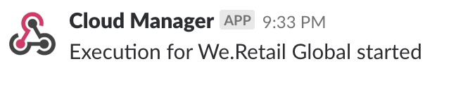
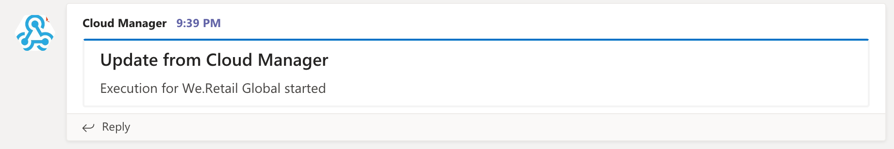

import Glitch from "../../components/glitch"

# Tutorial Step 7 - Sending Notifications

Congratulations! You've reached the end of the tutorial. This last step actually has nothing to do with Cloud Manager or Adobe I/O. In this step, we're going to take the data retrieved and send a message to either Microsoft Teams or Slack. Or you could do both if you are feeling adventurous.

## Setting up a Notification Webhook

For both Microsoft Teams and Slack, notifications can be sent via an Incoming Webhook integration. The details are slightly different, but both follow the same basic concept -- when you want to post a message to a channel, you can make an HTTP POST request to a special URL generated specifically for this purpose.

Documentation to create a webhook URL for Microsoft Teams can be found <a href="https://docs.microsoft.com/en-us/microsoftteams/platform/concepts/connectors/connectors-using#setting-up-a-custom-incoming-webhook">here</a>

Documentation to create a webhook URL for Slack can be found <a href="https://api.slack.com/incoming-webhooks" target="_new">here</a>.

### Notifying Slack

Sending a Slack notification can be done with just a simple JSON object containing a `text` property. Let's create a new function which sends such an object to the webhook. To make the webhook easy to chnage, add a new variable to your `.env` file named `SLACK_WEBHOOK` and create this function:

```javascript
function notifySlack(message) {
  fetch(process.env.SLACK_WEBHOOK, {
    method: "POST",
    headers: { "Content-Type": "application/json" },
    body: JSON.stringify({
      text: message,
    }),
  });
}
```

And the invoke this function instead of logging:

```javascript
if (
  STARTED === event["@type"] &&
  EXECUTION === event["xdmEventEnvelope:objectType"]
) {
  console.log("received execution start event");

  const executionUrl = event["activitystreams:object"]["@id"];

  getExecution(executionUrl).then((execution) => {
    notifySlack(`Execution for ${execution.program.name} started`);
  });
}
```

This will produce a Slack message which looks like this:



<InlineAlert slots="text" />

Of course, feel free to make the message more complex if you want.

<Glitch projectName="adobe-cloudmanager-api-tutorial-step7-slack" />

### Notifying Microsoft Teams

Sending a Microsoft Teams notification can be as simple as Slack -- just a single `text` property. But Teams also supports some slightly fancier formatting options -- notifications can have a title and banner color, among other options. As with the Slack webhook, you should put the webhook URL in your `.env` file in a variable named `TEAMS_WEBHOOK`.

```javascript
function notifyTeams(message) {
  fetch(process.env.TEAMS_WEBHOOK, {
    method: "POST",
    headers: { "Content-Type": "application/json" },
    body: JSON.stringify({
      "@context": "https://schema.org/extensions",
      "@type": "MessageCard",
      themeColor: "0072C6",
      title: "Update from Cloud Manager",
      text: message,
    }),
  });
}
```

<InlineAlert slots="text" />

There are a number of other options for the payload sent to Microsoft. Please read the <a href="https://docs.microsoft.com/en-us/outlook/actionable-messages/actionable-messages-via-connectors" target="_new">documentation</a> for more information.

And then invoke this function:

```javascript
if (
  STARTED === event["@type"] &&
  EXECUTION === event["xdmEventEnvelope:objectType"]
) {
  console.log("received execution start event");

  const executionUrl = event["activitystreams:object"]["@id"];

  getExecution(executionUrl).then((execution) => {
    notifyTeams(`Execution for ${execution.program.name} started`);
  });
}
```

This will produce a Microsoft Teams message which looks like this:



<Glitch projectName="adobe-cloudmanager-api-tutorial-step7-teams" />