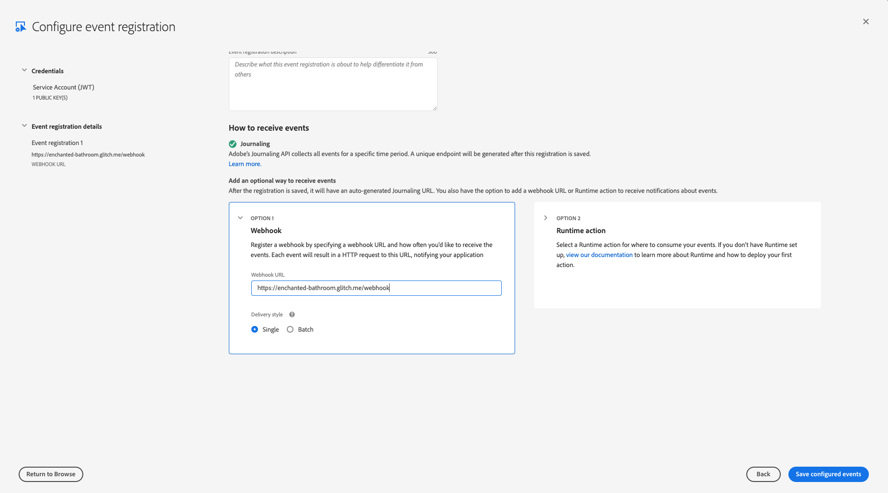
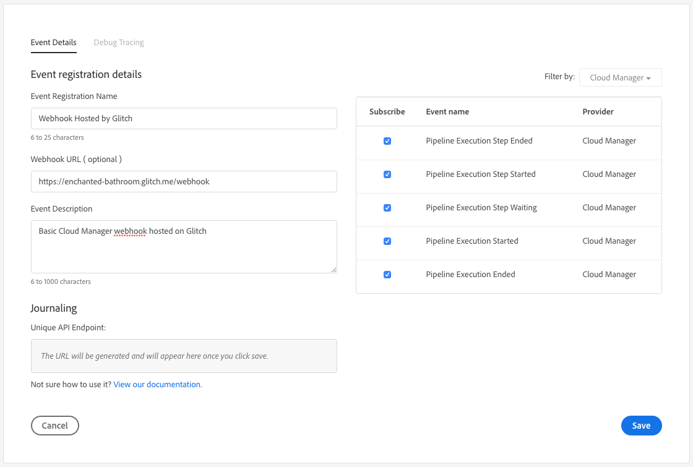

## Tutorial Step 1 - A Basic Webhook

In the first step of the tutorial, we're going to create an event handler (webhook) which is compatible with Adobe I/O Events. This webhook doesn't actually do much; it just logs the body of the request. But it provides a skeleton on which you'll build in later steps.

### Dependencies

To write the webhook, this tutorial uses <a href="https://expressjs.com/" target="_new">Express</a>, a minimal web framework for Node.js. To automate the parsing of JSON requests, the `body-parser` package is used. Finally, a package named `dotenv` is used to parse and load the `.env` file created in [Step 0](0-setup.md). To install these three packages, run

```bash
npm install express body-parser dotenv
```

### Writing the Webhook Script

Now you're ready to write the webhook script itself. Create a new file named `index.js` and open it in your IDE.

The webhook script itself has four main parts. The first part is including the dependencies, loading the `.env` file, and setting up the Express application:

```javascript
const express    = require('express'),
      bodyParser = require('body-parser');

require('dotenv').config();

const app = express();

app.use(bodyParser.json());
```

The second and third parts are the Express _routes_. These are JavaScript functions that handle specific request patterns. An Adobe I/O webhook must handle two different types of requests.

1. It must handle GET requests with a `challenge` query string parameter by responding with the `challenge` parameter.
2. It must handle POST requests by responding with a 200 status code. This is how the actual events will be received.

For the purpose of this tutorial, the path `/webhook` is used. This can be any path, even just `/`, but the **same** path must be used for both the GET and POST routes.

The challenge handler looks like this:

```javascript
app.get('/webhook', (req, res) => {
  if (req.query["challenge"]){
    res.send(req.query['challenge']);
  } else {
    console.log("No challenge");
    res.status(400);
  }
});
```

For the POST handler, at this point in the tutorial, it should just log the body and then write something trivial as a response. 

```javascript
app.post('/webhook', (req, res) => {
  console.log(req.body);
  res.writeHead(200, { 'Content-Type': 'application/text' });
  res.end("pong");
});
```

The last part of the script is to start listening for requests. Here, the `PORT` variable specified in the `.env` file is used.

```javascript
var listener = app.listen(process.env.PORT, () => {
  console.log('Your app is listening on port ' + listener.address().port);
});
```

### Running the Webhook Script

You have at least two options to run the webhook script. The first way is to simply run it locally with

```bash
node index.js
```

You should see a message that it is up and running:

```bash
Your app is listening on port 4000
```

#### Creating a Tunnel with ngrok

In order to use the webhook with Adobe I/O, it must be accessible to the public internet. But, your development machine is probably not accessible. So you need to open a _tunnel_ allowing public access to the webhook. One popular tool for doing this is <a href="https://ngrok.com" target="_new">ngrok</a>. Follow the instructions on the ngrok website to install it. Once it is installed, you can open up a tunnel by running

```bash
ngrok http 4000
```

> If you changed the `PORT` variable in the `.env` file to something else, adjust the command to suit.

Once running ngrok will show you two _forwarding_ addresses:

```
Forwarding                    http://e639e8fd.ngrok.io -> localhost:4000
Forwarding                    https://e639e8fd.ngrok.io -> localhost:4000
```

> For the purpose of this tutorial, the free ngrok service is acceptable. Just keep in mind that every time you restart ngrok you will get a new URL.

#### Running the Webhook Script with Glitch

Alternatively, you can run the webhook script using <a href="https://glitch.com/" target="_new">Glitch</a>. Glitch is an interactive web-based code editor for Node.js applications with built-in hosting. To save you the trouble of copy and pasting the files you've created already, you can just click the button below to create a new application on Glitch pre-populated with the content of the tutorial so far.

<!-- Remix Button -->
<a href="https://glitch.com/edit/#!/remix/adobe-cloudmanager-api-tutorial-step1" target="_new">
  
</a>

> Feel free to create an account with Glitch if you want to continue to use it in subsequent steps of the tutorial.

### Registering the Webhook with Adobe I/O

Now that you have your webhook running at a publicly accessible URL, you can register it with Adobe I/O. To do this, open the <a href="https://console.adobe.io/integrations" target="_new">Adobe I/O Console</a> and open the Integration you created in Step 0. Switch to the Events tab.



Select Cloud Manager in the `Add New Event Provider` section and click the `Add event provider` button. Then click the `Add Event Registration` button. Provide a name and description for the webhook and select the events you want to subscribe to. For the purpose of this tutorial, you will need **at least** the Pipeline Execution Started event.

If you are using ngrok, the Webhook URL will be the Forwarding address appended with `/webhook`, e.g. `https://e639e8fd.ngrok.io/webhook`. If you are using Glitch, the URL will be the Glitch application name appended with `.glitch.me/webhook`, e.g. `https://enchanted-bathroom.glitch.me/webhook`



Click the Save button.

#### Next Step

With all that done, you're ready to proceed to the next step. Continue to [Step 2](2-webhook-signature-validation.md).

<style type="text/css">
#kirbyMainContent .hljs .hljs-function,
#kirbyMainContent .hljs .hljs-params {
    color: #333;
}
</style>